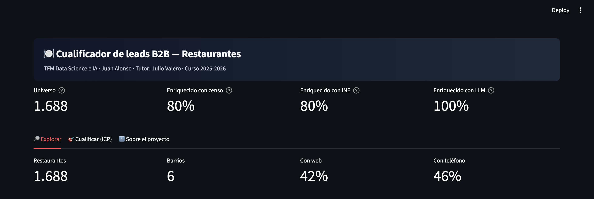
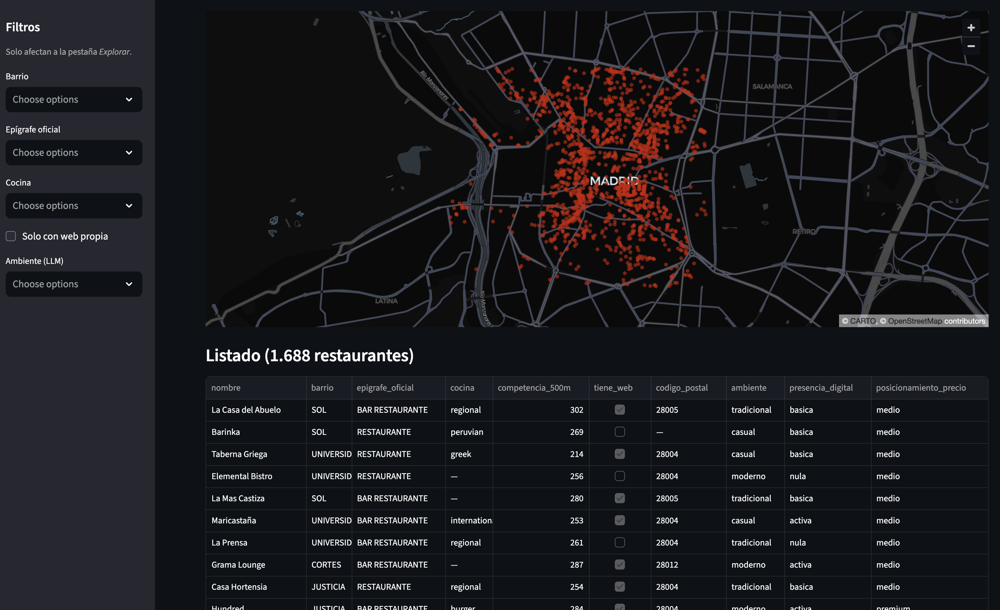
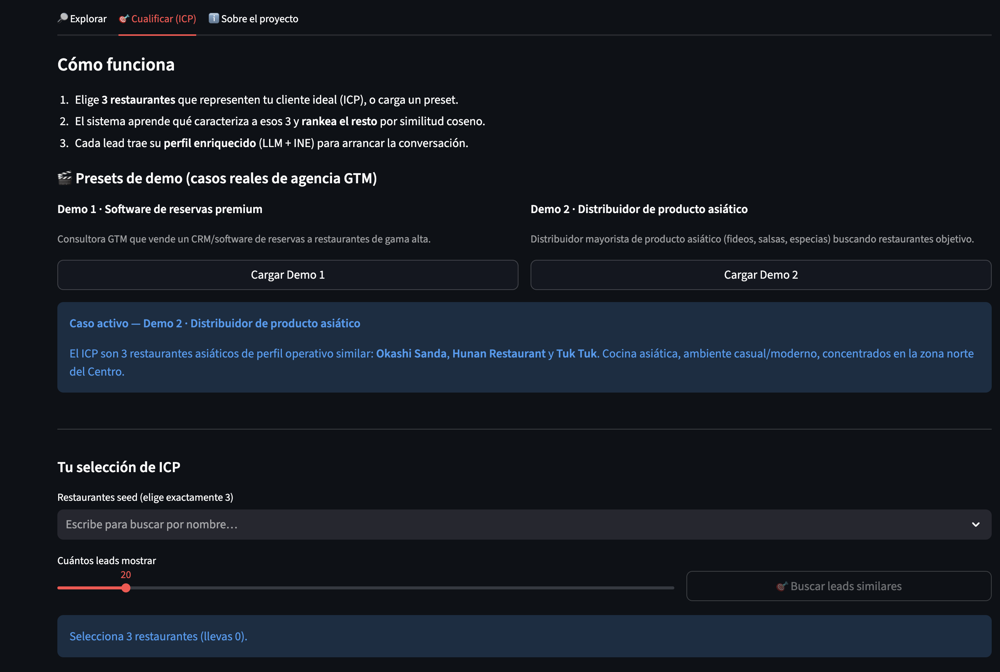
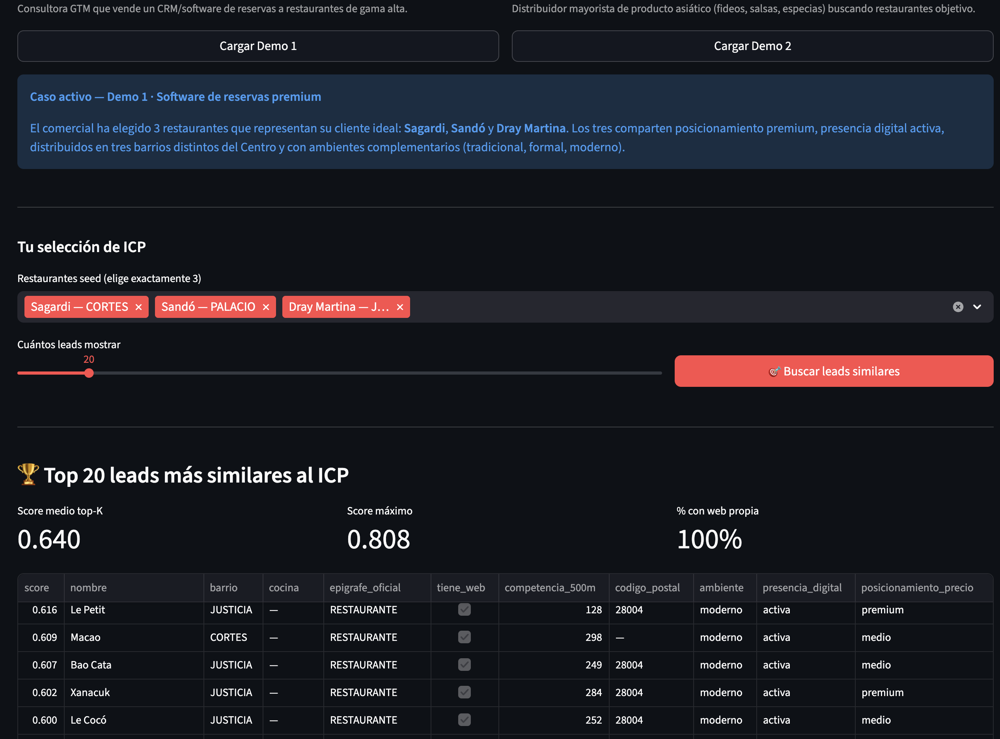
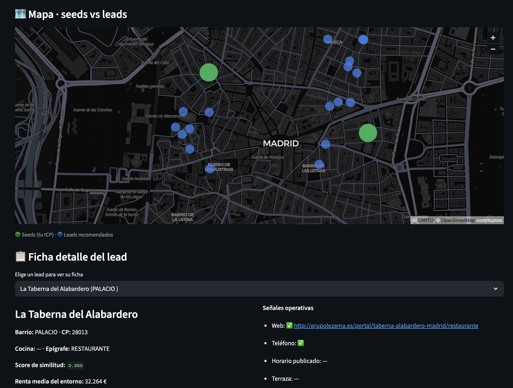
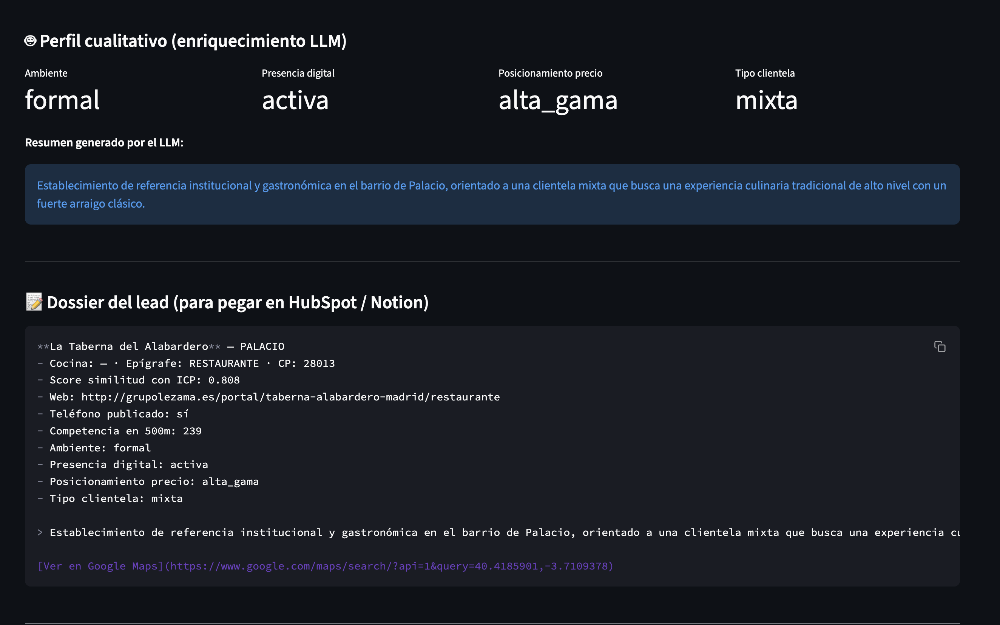

# Entrega 5 — Diseño del frontal y experiencia de usuario

- **Autor:** Juan Alonso
- **Tutor:** Julio Valero
- **Curso:** 2025-2026

---

## Nota preliminar

El enunciado plantea el diseño del frontal como un **mockup**. Como la aplicación real ya está desarrollada y funcional en Streamlit, esta entrega se articula sobre **capturas del frontal real** en lugar de un mockup. Es una decisión deliberada: mostrar el producto tal como se comportará en la defensa es más honesto y aporta más información sobre las decisiones de diseño reales que un mockup abstracto.

El código de la app está disponible en el repositorio (`app/app.py`) y se ejecuta con `streamlit run app/app.py`.

---

## 1. Utilidad — a qué usuario sirve y qué problema resuelve el frontal

### Usuario objetivo

El frontal está diseñado para dos perfiles complementarios dentro del mismo caso de uso:

- **Comercial B2B de una agencia GTM** que trabaja campañas de outbound (cold email, LinkedIn, secuencias multicanal) sobre restaurantes de Madrid. Este usuario tiene identificados a sus mejores clientes actuales y necesita encontrar leads similares en el universo de restaurantes disponibles.

- **Analista de datos o responsable de estrategia comercial** que quiere explorar el universo de restaurantes del Centro de Madrid antes de definir una campaña. Este usuario necesita filtrar, segmentar y descargar subconjuntos del universo.

### Problema que resuelve el frontal

El frontal traduce un motor complejo de datos y modelado (capa gold de 33 features, enriquecimiento LLM, modelo de similitud coseno) en **dos flujos comprensibles para usuarios que no saben programar**:

1. **Explorar** el universo por filtros clásicos (barrio, cocina, epígrafe...) para entender qué hay.
2. **Cualificar** un conjunto de leads similares a un ICP definido con solo 3 restaurantes-ejemplo.

Sin este frontal, el mismo motor exigiría escribir código Python y consultar parquets — inviable en un contexto comercial. Con el frontal, el usuario obtiene ranking, mapa y dossier listos para pegar en HubSpot/Notion en menos de 30 segundos.

### Decisiones clave de utilidad

- **Se muestra el número real del universo (1.688 restaurantes) en la cabecera** para que el usuario entienda inmediatamente el alcance.
- **Se ofrecen dos presets de demo** que representan casos comerciales reales de agencia GTM, para que el usuario entienda el potencial sin tener que pensar qué seeds elegir.
- **Cada lead recomendado incluye un dossier completo listo para copiar y pegar** en la herramienta CRM del comercial, eliminando trabajo manual de resumen.

*Cabecera de la aplicación. Los cuatro KPIs de la parte superior (Universo, Enriquecido con censo, Enriquecido con INE, Enriquecido con LLM) informan al usuario del volumen del dataset y del nivel de enriquecimiento del que dispone antes de operar sobre él. Los tooltips (icono "?") explican qué representa cada indicador.*

---

## 2. Flujo de usuario — cómo se recorre la aplicación

### Estructura general

La aplicación se organiza en **tres pestañas horizontales** en la parte superior, en el orden que sigue la mentalidad del usuario:

- **🔎 Explorar** — para entender el universo.
- **🎯 Cualificar (ICP)** — para actuar sobre ese universo.
- **ℹ️ Sobre el proyecto** — para consultar decisiones metodológicas del TFM.

El orden refleja el recorrido natural: primero se explora lo que hay, después se opera sobre ello. La tercera pestaña sirve como referencia académica, no interfiere con el uso operativo.

### Flujo 1 — Explorar

El usuario aterriza en la pestaña Explorar (por defecto). Ve el universo completo en un mapa y en un listado tabular. En el sidebar izquierdo dispone de cinco filtros: **Barrio, Epígrafe oficial, Cocina, Solo con web propia** y **Ambiente (generado por LLM)**. Los filtros son multivalor y se aplican en tiempo real: los KPIs de la parte superior (Restaurantes, Barrios, % con web, % con teléfono) se recalculan al instante, igual que el mapa y el listado.

Al final del listado se ofrece un botón de descarga a CSV para llevarse el subconjunto filtrado a Excel, Clay o cualquier otra herramienta externa.

*Pestaña Explorar. Filtros en el sidebar izquierdo. Mapa central con los 1.688 restaurantes concentrados en el distrito Centro de Madrid. Listado tabular con las columnas más relevantes del modelo (nombre, barrio, epígrafe, cocina, competencia, indicadores operativos y variables generadas por LLM). La atribución de OpenStreetMap y CARTO se muestra abajo a la derecha en cumplimiento de las licencias de las fuentes.*

### Flujo 2 — Cualificar (ICP)

Aquí ocurre el valor diferencial del sistema. La pestaña se abre con:

1. **Instrucciones "Cómo funciona"** en tres pasos numerados que anticipan el flujo.
2. **Dos botones de presets** — Demo 1 (software de reservas premium) y Demo 2 (distribuidor de producto asiático) — que cargan casos comerciales reales.
3. **Selector manual** para que el usuario pueda componer su propio ICP.
4. **Slider** para elegir cuántos leads mostrar (10 a 100, por defecto 20).
5. **Botón "Buscar leads similares"** — el CTA principal, en rojo cuando está activo.

El botón permanece **desactivado hasta que se hayan seleccionado exactamente 3 restaurantes**, con un aviso azul que indica al usuario cuántos lleva. Este bloqueo previene el error clásico de lanzar el modelo con un ICP mal definido.

*Pestaña Cualificar antes de operar. La sección "Cómo funciona" explica el flujo. Los dos presets de demo dan casos comerciales concretos. El desplegable permite selección manual libre. Cuando ningún seed está seleccionado, el botón "Buscar leads similares" permanece bloqueado y un mensaje azul indica al usuario qué le falta.*

### Flujo 3 — Resultados del ICP

Al pulsar "Buscar leads similares", la vista se amplía con cuatro secciones apiladas:

1. **Tres métricas clave** (Score medio del top-K, Score máximo, % de leads con web propia).
2. **Ranking tabular** ordenado por score, con descarga a CSV.
3. **Mapa seeds vs leads** con los tres seeds en verde y los leads en azul.
4. **Ficha detalle** del lead que el usuario elija en un selector.

*Resultados del ICP premium (seeds Sagardi, Sandó, Dray Martina). El score máximo es 0.808 y el score medio del top-20 es 0.640. El 100% de los leads recomendados tiene web propia — señal muy alineada con el ICP premium (un vendedor de software de reservas premium prefiere restaurantes ya digitalizados). El ranking devuelve nombres reales del segmento premium de Madrid, sin sesgo hacia una cocina concreta.*

*Mapa geográfico con los seeds del ICP (verde) y los leads recomendados (azul). Se aprecia la concentración de leads en Justicia (Chueca) y Palacio, coherente con la naturaleza premium del ICP. Debajo, la ficha detalle del lead seleccionado (La Taberna del Alabardero, score 0.808) muestra el nombre, ubicación, cocina, score de similitud, renta media del entorno (32.264 €) y las señales operativas del restaurante.*

*Parte inferior de la ficha detalle. Perfil cualitativo generado por el LLM (ambiente, presencia digital, posicionamiento, clientela) con un resumen textual que contextualiza el restaurante para el comercial. Al final, un dossier en formato Markdown listo para copiar y pegar directamente en HubSpot, Notion o cualquier herramienta CRM.*

---

## 3. Experiencia de usuario — decisiones de diseño

### Simplicidad radical del CTA

La acción principal es una sola: pulsar "Buscar leads similares". El resto del flujo (cargar preset, elegir seeds, ajustar K) alimenta esa acción. **Esto responde al principio de que una interfaz que pide más de una decisión primaria confunde al usuario**. La demo del comercial es: cargar preset → pulsar botón → leer resultados.

### Presets como ancla narrativa

Los presets de demo no son solo un atajo técnico — son **narrativas comerciales completas** que contextualizan el ICP. Al pulsar "Cargar Demo 1", aparece un cuadro azul explicando quién es el cliente (consultora GTM), qué producto vende (software de reservas premium), qué restaurantes ha elegido como ejemplo y por qué. Esto convierte una demo técnica en una historia comprensible para cualquier no-técnico.

### Bloqueo de estados inválidos

El botón "Buscar leads similares" solo se activa con exactamente 3 seeds. Es una restricción **coherente con la técnica de few-shot learning que respalda el modelo**: el sistema está diseñado para operar con 3 ejemplos, y forzar esa cardinalidad evita ambigüedades sobre qué significa "un ICP" para el usuario.

### Multiescala de información

La misma pantalla convive con:

- **Vista agregada** — KPIs, mapa, distribuciones globales.
- **Vista de ranking** — tabla con los top-K leads.
- **Vista individual** — ficha detalle de un lead concreto.

El usuario puede recorrer del macro al micro sin cambiar de contexto ni de pestaña.

### Salida operativa lista para usar

El **dossier del lead en formato Markdown** es una decisión de diseño clave. En vez de dejar al comercial recomponer manualmente la información del lead para pegarla en su CRM, la app genera el bloque completo listo para copiar. Este pequeño detalle traduce el sistema de "herramienta analítica" a **herramienta operativa integrada en el flujo comercial**.

### Enlace directo a Google Maps

Cada lead incluye un enlace a Google Maps con las coordenadas exactas. Elimina la fricción de "buscar el sitio a mano" y respeta un principio básico: **cada dato que se pueda accionar en un clic debe estar accionable en un clic**.

### Tema oscuro deliberado

La aplicación se muestra en tema oscuro para transmitir la estética de herramienta profesional de análisis (tipo dashboards de producto tecnológico moderno), en línea con el posicionamiento del producto como sistema pensado para uso continuado por parte del equipo comercial.

### Sidebar contextual

El sidebar de filtros solo aplica a la pestaña Explorar y así se indica explícitamente ("Solo afectan a la pestaña Explorar"). Esta anotación pequeña evita la confusión clásica de que un usuario aplique filtros y luego vaya a Cualificar esperando que persistan.

### Feedback visual continuo

- **Los KPIs se recalculan al aplicar filtros** — el usuario ve el efecto inmediato de cada acción.
- **El botón CTA cambia de gris a rojo** cuando se cumplen las condiciones necesarias.
- **Los seeds seleccionados aparecen como chips visibles** para que el usuario nunca dude qué ha cargado.
- **Los mensajes azules informativos** ("Selecciona 3 restaurantes", "Caso activo") acompañan cada estado del flujo.

---

## 4. Puntos débiles y próximos pasos del frontal

### Puntos débiles reconocidos

**1. Explicabilidad del score.** Actualmente el score de similitud es un número (por ejemplo 0.808) pero no se muestra al usuario **qué features han pesado más** en ese resultado. Un comercial sofisticado querría saber "este lead entra porque comparte barrio, ambiente y renta con dos de tus seeds". Sería directamente accionable e incrementaría la confianza del usuario en el sistema.

**2. Completitud de las señales operativas.** Los indicadores operativos de cada lead (web, teléfono, horario, terraza, delivery, takeaway, accesible) provienen de OpenStreetMap y dependen del voluntariado que mantiene esa fuente. Restaurantes históricos o con ficha antigua muestran muchos campos vacíos. En la práctica esto limita la utilidad del dossier: por ejemplo, La Taberna del Alabardero (score máximo del ejemplo) aparece solo con web y teléfono, sin horario ni terraza.

**3. Vocabulario no normalizado de la variable `cocina`.** La columna cocina viene de OSM sin normalización semántica: aparecen variantes como `spanish`, `spanish;tapas`, `regional;spanish` o `regional` que conceptualmente representan lo mismo. Esto afecta ligeramente al filtro de la pestaña Explorar y a la señal one-hot que el modelo usa como feature.

**4. Sesgo del ranking según seeds.** El resultado del modelo es sensible a la composición del ICP: si uno de los seeds tiene una firma vectorial muy densa (por ejemplo un japonés premium en Palacio), su influencia en el centroide puede sesgar el ranking hacia perfiles muy parecidos a él. El sistema deja esta decisión en manos del usuario (elegir seeds equilibrados), pero podría ofrecer feedback visual sobre la homogeneidad interna del ICP.

**5. No hay persistencia entre sesiones.** Cada vez que el usuario refresca, pierde su selección. Un despliegue en producción incluiría un guardado de "mis ICPs favoritos" y de "campañas anteriores".

### Próximos pasos del frontal

**Explicabilidad por lead.** Añadir SHAP values o, más simple, una descomposición del score por bloque de features (numéricas, categóricas, embedding LLM) para que el comercial entienda de un vistazo qué señala el sistema.

**Generación de emails personalizados con LLM.** Con el perfil cualitativo del lead ya generado, es directo pedir al LLM que redacte el primer email de outbound personalizado. Es la extensión natural del sistema hacia el flujo operativo completo.

**Integración con CRMs y herramientas de outbound.** Integraciones directas con HubSpot, Pipedrive, Clay o Smartlead — hoy el dossier es copy-paste, mañana podría ser un botón "Enviar al CRM".

**Enriquecimiento demográfico ampliado del INE.** El sistema actual solo utiliza la renta media del INE. Para el caso concreto de restauración en el Centro de Madrid, las demás variables demográficas del INE aportarían poco (edad, población y tamaño de hogar varían poco entre secciones urbanas céntricas). Pero **el sistema es genérico**: aplicado a otros sectores B2B como gimnasios (interesa edad media), guarderías (tamaño del hogar y % menores), ópticas o clínicas geriátricas (edad media alta), inmobiliarias premium (renta alta + índice de Gini), estas variables serían mucho más discriminativas. Un siguiente paso natural es ampliar la capa de enriquecimiento con estas variables como opciones seleccionables según el vertical.

**Escalado horizontal a otros sectores.** El frontal está diseñado sobre datos de restauración, pero la arquitectura es agnóstica al sector. Un siguiente paso sería un selector superior "Vertical" que permitiera cambiar entre restaurantes, clínicas dentales, gimnasios, farmacias, etc., alimentando cada vertical con sus datos propios.

**Escalado geográfico.** Del Centro de Madrid a toda la ciudad, a España y a otros países. Las fuentes utilizadas (OpenStreetMap, censos municipales, INE) tienen equivalentes en la mayoría de países desarrollados.

---

## 5. Resumen ejecutivo

El frontal desarrollado en Streamlit sirve como interfaz operativa completa del sistema de cualificación de leads. No es un mockup ni una demo estática: es la aplicación real que se defiende, con el motor de similitud coseno operando sobre la capa gold enriquecida (OpenStreetMap + censo municipal + INE + LLM). La aplicación resuelve dos flujos complementarios (explorar el universo y cualificar un ICP) con decisiones de UX que priorizan la simplicidad del CTA, el feedback visual continuo y la salida directamente accionable para el comercial. Las limitaciones actuales (explicabilidad del score, completitud OSM, normalización de vocabularios) están reconocidas y forman parte de la agenda de próximos pasos, junto con la ampliación del sistema a otros sectores verticales del B2B.
